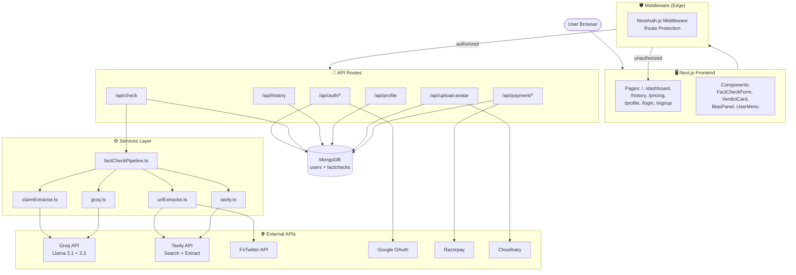
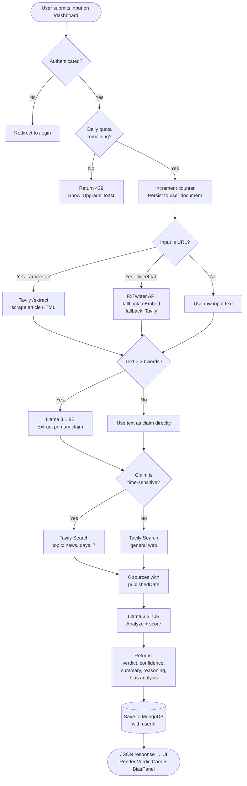
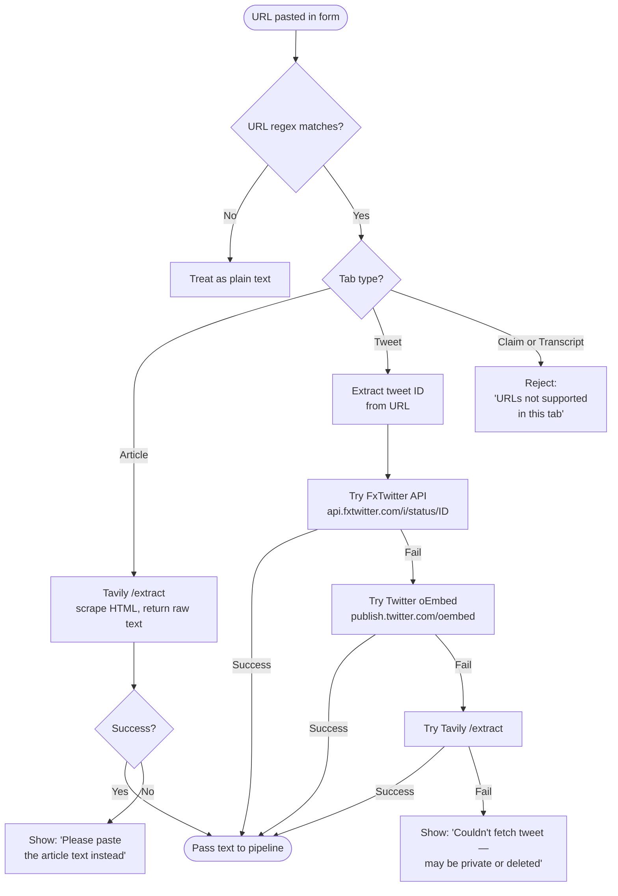
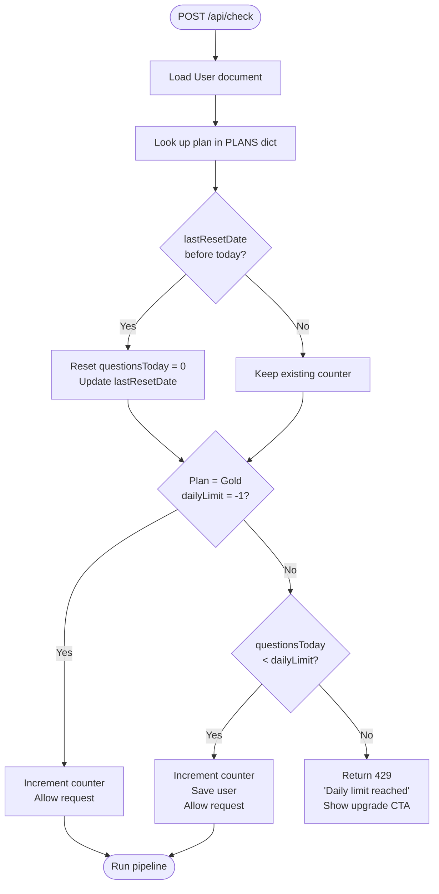
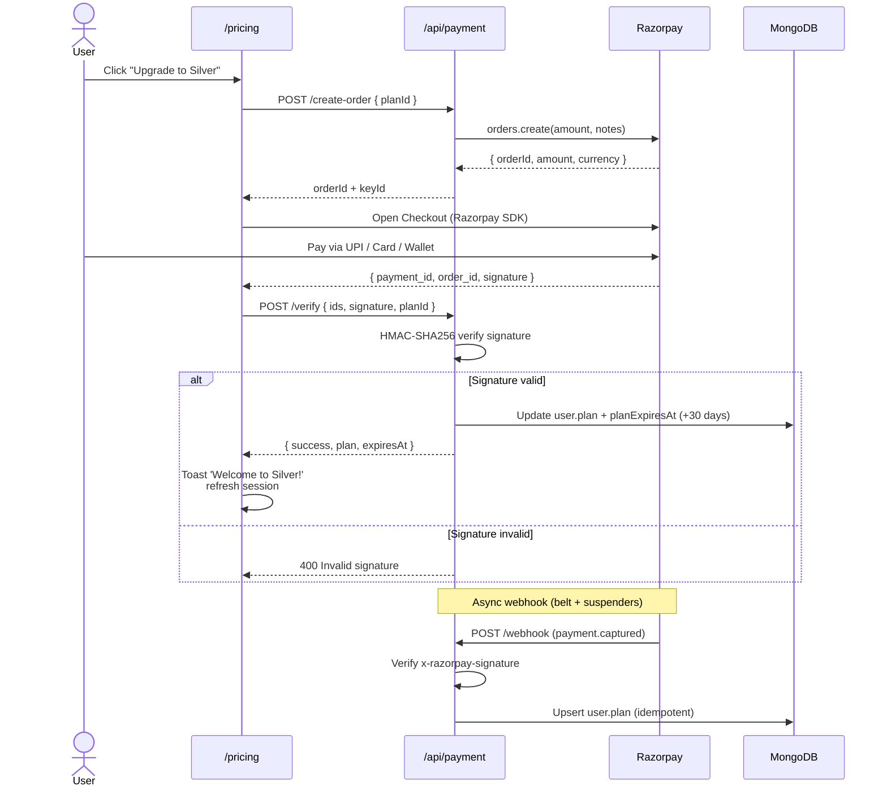

# TruthLens AI

Real-Time AI-Powered Fact Checking System built with Next.js 15, TypeScript, Groq (Llama 3.3), Tavily, and MongoDB. Features authentication, per-user history, daily quotas, three subscription tiers, and Razorpay billing.

---

## Features

- **Multi-format input** — claims, articles, tweets, transcripts, or raw URLs (article + Twitter/X links auto-extract)
- **AI pipeline** — claim extraction → live evidence search → verdict + bias analysis
- **Groq-powered analysis** — Llama 3.3 70B for verdicts, Llama 3.1 8B for fast extraction (all free tier)
- **5 verdicts** — TRUE / FALSE / MISLEADING / PARTIALLY TRUE / NOT ENOUGH EVIDENCE
- **Bias analysis** — political lean, emotional language, source credibility, bias signals
- **Real-time mode** — auto-detects time-sensitive claims and prioritizes news from the last 7 days
- **Authentication** — Google OAuth + email/password via NextAuth.js v5
- **Per-user history** — every user sees only their own checks
- **Daily quotas** — Free (10/day), Silver (50/day), Gold (unlimited)
- **Razorpay payments** — UPI, cards, netbanking, wallets supported
- **Profile pictures** — Cloudinary uploads with DiceBear default avatars
- **Glassmorphism UI** — dark mode, Framer Motion animations, mobile-first

---

## Tech Stack

| Layer | Technology |
|---|---|
| Framework | Next.js 15 App Router |
| Language | TypeScript |
| Auth | NextAuth.js v5 (Google + Credentials) |
| Styling | Tailwind CSS + Framer Motion |
| AI / LLM | Groq (`llama-3.3-70b-versatile` + `llama-3.1-8b-instant`) |
| Search | Tavily Search + Tavily Extract |
| Database | MongoDB via Mongoose |
| Image storage | Cloudinary |
| Payments | Razorpay |
| Validation | Zod |

---

## System Architecture

The diagram below shows how every request flows through TruthLens.



---

## How It Works: Fact-Check Pipeline

When a user submits a claim, this is the full journey from input to verdict.



---

## Authentication Flow

Two providers: **Google OAuth** (one-click) and **Credentials** (email + bcrypt-hashed password). NextAuth.js v5 uses JWT sessions.

```mermaid
flowchart LR
    User([User]) --> Choice{Provider}

    Choice -->|Google| Google[Google OAuth Consent]
    Google --> Callback[/api/auth/callback/google]
    Callback --> CheckUser{User exists?}
    CheckUser -->|No| Create[Create User<br/>with default DiceBear avatar]
    CheckUser -->|Yes| Existing[Load existing user]
    Create --> JWT
    Existing --> JWT

    Choice -->|Email/Password<br/>Signup| Register[/api/auth/register<br/>bcrypt hash password]
    Register --> CreateCred[Create User<br/>plan = 'free']
    CreateCred --> AutoSignIn[Auto sign-in]
    AutoSignIn --> JWT

    Choice -->|Email/Password<br/>Login| Verify[Lookup user<br/>bcrypt.compare]
    Verify -->|Match| JWT
    Verify -->|No match| Reject[Show 'Invalid credentials']

    JWT[Issue JWT<br/>id + plan claims]
    JWT --> Cookie[Set HTTP-only cookie]
    Cookie --> Dashboard([Redirect to /dashboard])
```

---

## URL Extraction Logic

The Article and Tweet tabs accept raw URLs. The system tries multiple strategies and falls back gracefully.



---

## Quota & Plan Enforcement

Every fact-check call passes through `lib/quota.ts`, which atomically resets daily counters and enforces plan limits.



---

## Payment Flow (Razorpay)

Razorpay was chosen for the easiest setup in India — instant test keys with no business verification needed.



---

## Plans

| Plan | Daily limit | Price | Features |
|---|---|---|---|
| **Free** | 10 checks/day | ₹0 | Verdict + bias + real-time detection + personal history |
| **Silver** | 50 checks/day | ₹199/month | Everything in Free + priority processing + URL extraction + email support |
| **Gold** | Unlimited | ₹499/month | Everything in Silver + priority support + early access + CSV export |

Plans auto-expire after 30 days. Upgrade triggers immediate plan switch via Razorpay webhook + checkout callback (double-verified).

---

## Quick Start

### 1. Clone and install

```bash
git clone <your-repo>
cd truthlens
npm install
```

### 2. Set up environment variables

```bash
cp .env.example .env.local
```

Then fill in the values — see the **Service Setup** section below for how to get each one.

### 3. Run the dev server

```bash
npm run dev
```

Open [http://localhost:3000](http://localhost:3000), click **Sign up**, and start fact-checking.

---

## Service Setup

All services have free tiers — you can run TruthLens end-to-end without paying anything.

| Service | Purpose | Free tier | Setup link |
|---|---|---|---|
| **MongoDB Atlas** | Database (users, fact checks) | 512 MB | https://mongodb.com/atlas |
| **Groq** | LLM (Llama 3.1 + 3.3) | 14,400 req/day | https://console.groq.com/keys |
| **Tavily** | Web search + URL extract | 1,000 req/month | https://tavily.com |
| **Google Cloud Console** | OAuth | Free | https://console.cloud.google.com/apis/credentials |
| **Cloudinary** | Avatar storage | 25 GB | https://cloudinary.com/users/register/free |
| **Razorpay** | Payments | Free (test mode) | https://dashboard.razorpay.com |

### Google OAuth setup

1. Go to [Google Cloud Console → Credentials](https://console.cloud.google.com/apis/credentials)
2. Create **OAuth 2.0 Client ID** → Web application
3. Add Authorized redirect URI: `http://localhost:3000/api/auth/callback/google`
4. Copy Client ID and Secret into `.env.local`

### Razorpay webhook setup

1. Dashboard → **Settings → Webhooks → Add Webhook**
2. URL: `http://localhost:3000/api/payment/webhook` (use [ngrok](https://ngrok.com) for local testing)
3. Subscribe to event: `payment.captured`
4. Copy the **Webhook Secret** into `.env.local` as `RAZORPAY_WEBHOOK_SECRET`

### NextAuth secret

```bash
npx auth secret
```

Or generate any random string (32+ chars) and set as `AUTH_SECRET`.

---

## Project Structure

```
/app
  /api
    /auth/[...nextauth]    NextAuth handlers
    /auth/register         POST: create user (credentials)
    /check                 POST: fact-check pipeline + quota
    /history               GET/DELETE: per-user history
    /profile               GET/PATCH: profile data
    /upload-avatar         POST: Cloudinary upload
    /payment/create-order  POST: Razorpay order
    /payment/verify        POST: signature verification
    /payment/webhook       POST: async confirmation
  /dashboard               Fact check interface
  /history                 Paginated history
  /login, /signup          Auth pages
  /pricing                 Subscription plans
  /profile                 User profile + plan + quota
  /settings                API key documentation
  layout.tsx               Wraps app in SessionProvider
  page.tsx                 Landing page

/components
  FactCheckForm.tsx        Tabbed input form
  VerdictCard.tsx          Main result card
  BiasPanel.tsx            Political lean + bias indicators
  EvidencePanel.tsx        Sources + reasoning
  ConfidenceMeter.tsx      0-100% animated bar
  VerdictBadge.tsx         Animated badge
  HistoryTable.tsx         Paginated history list
  LoadingAnimation.tsx     Pipeline step indicator
  Navbar.tsx               Top nav with user menu
  UserMenu.tsx             Avatar dropdown
  providers/SessionProvider.tsx
  ui/                      Button, Card, Tabs, etc.

/services
  factCheckPipeline.ts     Orchestrates the full pipeline
  urlExtractor.ts          Article/tweet URL → text
  claimExtractor.ts        Llama 3.1 — claim extraction
  groq.ts                  Llama 3.3 — verdict + bias
  tavily.ts                Evidence search + real-time mode

/lib
  mongodb.ts               Mongoose connection pool
  plans.ts                 Free/Silver/Gold definitions
  quota.ts                 Daily counter + reset logic
  razorpay.ts              Order creation + signature verification
  cloudinary.ts            SDK configuration
  dicebear.ts              Default avatar generator
  models/
    User.ts                User schema (email, plan, quota)
    FactCheck.ts           Fact-check schema (userId-scoped)

/types
  index.ts                 Shared types (Verdict, BiasAnalysis, etc.)
  next-auth.d.ts           Session/JWT augmentation

auth.ts                    NextAuth.js v5 (Node — uses bcrypt)
auth.config.ts             Edge-safe config (used in middleware)
middleware.ts              Route protection
```

---

## Models Used

| Task | Model | Why |
|---|---|---|
| Claim extraction | `llama-3.1-8b-instant` | Fast, low latency, 128k context for long articles |
| Verdict + bias analysis | `llama-3.3-70b-versatile` | Best reasoning quality on Groq's free tier |

Both run on Groq's LPU inference hardware (~5-10x faster than equivalent OpenAI calls).

---

## Deploy to Vercel

```bash
npm install -g vercel
vercel
```

Add all environment variables from `.env.example` in your Vercel project dashboard under **Settings → Environment Variables**. Don't forget to:

1. Update Google OAuth redirect URI to your production URL: `https://your-domain.com/api/auth/callback/google`
2. Update Razorpay webhook URL to: `https://your-domain.com/api/payment/webhook`
3. Switch Razorpay keys from `rzp_test_*` to live keys after business verification

---

## License

MIT
# truthlens
